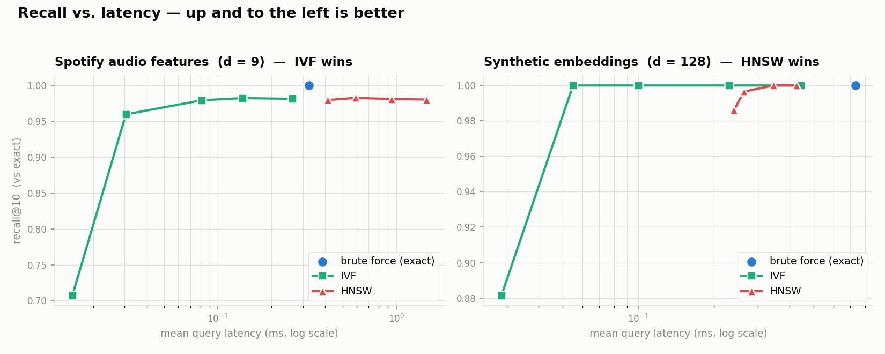

# Vector Search Engine — building the index, not importing one

[](https://github.com/Shr1yaK/vector-search-engine/actions/workflows/ci.yml)
&nbsp;
&nbsp;

A vector search engine implemented **from scratch on numpy** — k-means, an IVF
index, and an HNSW graph index — rigorously benchmarked against an exact
brute-force oracle, with a hand-written **C++ hot-path** and a real **semantic
music-discovery app** on top. No FAISS, no Pinecone, no sklearn.

Most ML-track projects import a vector database and stop. This one builds the
index itself, measures the recall / latency / memory trade-offs that make each
index a *choice* rather than a black box, then puts a working product on top:
type a mood — *"chill rainy day coding music"* — and it searches 114k Spotify
tracks by audio feel.

```
mood text ──▶ mood translator ──▶ query vector ──▶ [ HNSW | IVF | brute force ] ──▶ tracks
                (rule-based,                          (built from scratch,           + "why these"
                 offline)                              C++-accelerated)              + live benchmarks
```

---

## Why this is interesting

- **Real algorithms, not library calls.** Lloyd's k-means with k-means++
  seeding, IVF coarse quantization, and the full HNSW multi-layer graph
  (Malkov & Yashunin) — each implemented and unit-tested against exact k-NN.
- **Methodology, not "it works".** Every index is scored on recall@k, mean/p95
  latency, QPS, build time, and memory. The benchmark surfaced a genuine
  finding (below) about *when each index wins*.
- **Found the bottleneck, fixed it.** Profiling showed HNSW's per-hop distance
  call — not the arithmetic — was the cost. Porting that kernel to C++ via
  pybind11 gave a **2.4× build and query speedup at identical recall**.
- **Systems depth tied to a shipped product.** Vector search is the substrate
  of every RAG pipeline; here it drives a live semantic search UI.

---

## Headline results

Measured on a MacBook (Apple Silicon), 20k tracks/vectors, k=10, L2. Regenerate
with `python -m src.benchmark` and `python benchmarks/bench_highdim.py`.



*Generated by `python benchmarks/plot_results.py`. Up-and-to-the-left is better:
at d=9 IVF sits far left (fast, high recall) while HNSW lands to the right of
brute force; at d=128 the picture flips and HNSW beats exact search.*

**Spotify audio features (d = 9) — IVF wins:**

| index | params | recall@10 | mean latency | QPS | speedup vs exact |
|---|---|---|---|---|---|
| brute force | exact | 1.000 | 0.324 ms | 3,084 | 1× |
| **IVF** | nprobe=4 | **0.960** | **0.030 ms** | 32,802 | **10.6×** |
| IVF | nprobe=8 | 0.979 | 0.081 ms | 12,283 | 4.0× |
| HNSW | ef=20 | 0.983 | 0.593 ms | 1,687 | 0.5× |

At d=9, a cell scan of a few IVF partitions is so cheap that HNSW's graph
traversal overhead makes it *slower than brute force*.

**Synthetic embeddings (d = 128) — HNSW wins:**

| index | params | recall@10 | mean latency | QPS | speedup vs exact |
|---|---|---|---|---|---|
| brute force | exact | 1.000 | 0.732 ms | 1,366 | 1× |
| **HNSW** | ef=10 | **0.986** | **0.241 ms** | 4,157 | **3.0×** |
| HNSW | ef=50 | 1.000 | 0.346 ms | 2,890 | 2.1× |
| IVF | nprobe=4 | 1.000 | 0.055 ms | 18,191 | 13.3× |

As dimensionality grows, brute force and cell scans get expensive and HNSW's
logarithmic-ish hop count pays off — the crossover the low-D data hides.

**C++ hot-path (pybind11):**

| HNSW build (8k) | numpy | C++ kernel | speedup |
|---|---|---|---|
| build time | 33.9 s | 13.6 s | **2.50×** |
| query latency | 0.775 ms | 0.322 ms | **2.41×** |
| recall@10 | 0.987 | 0.987 | unchanged |

> **Takeaway I'd put on the résumé:** "Implemented IVF and HNSW from scratch and
> benchmarked them against exact search; showed IVF dominates at low
> dimensionality while HNSW wins on high-dimensional embeddings, and cut HNSW
> build/query time 2.4× with a pybind11 C++ distance kernel at no recall cost."

---

## The app

Type a mood; get tracks that *feel* like it, with a transparent breakdown of why
and a live benchmarks tab. Runs fully offline.

<!-- Screenshot: run `streamlit run src/app.py` and drop a capture at docs/img/app.png -->


> *(placeholder — add `docs/img/app.png` from a local run; the app renders
> without it.)*

---

## Quickstart

```bash
# 1. install
python -m pip install -r requirements.txt

# 2. get the dataset (~20 MB, 114k tracks; kept out of git)
python scripts/fetch_data.py

# 3. (optional) build the C++ hot-path for the 2.4x speedup
python cpp/build.py

# 4. run the tests (39 cases, all green)
pytest

# 5. launch the app
streamlit run src/app.py

# 6. regenerate benchmarks
python -m src.benchmark --n 20000 --queries 300 --tag n20k
python benchmarks/bench_highdim.py --n 20000 --d 128
python benchmarks/bench_native.py            # C++ vs numpy A/B
```

---

## Repo structure

```
vector-search-engine/
├── src/
│   ├── vectors.py          # data loading, Normalizer, distance kernels
│   ├── brute_force.py      # exact k-NN — the correctness oracle
│   ├── kmeans.py           # Lloyd's k-means + k-means++, from scratch
│   ├── ivf_index.py        # IVF: cluster once, probe nearest cells
│   ├── hnsw_index.py       # HNSW multi-layer navigable graph
│   ├── benchmark.py        # recall / latency / build / memory harness
│   ├── mood_translator.py  # mood text -> audio-feature query (offline)
│   └── app.py              # Streamlit UI (discover + benchmarks)
├── cpp/
│   ├── distance.cpp        # pybind11 L2 kernels (hot-path port)
│   └── build.py            # one-command in-place compile
├── benchmarks/
│   ├── bench_native.py     # C++ vs numpy A/B
│   ├── bench_highdim.py    # dimensionality crossover
│   └── results/            # committed JSON + Markdown runs
├── tests/                  # 39 pytest cases (index vs oracle agreement)
├── scripts/fetch_data.py   # dataset downloader
└── docs/                   # architecture + benchmark writeups
```

See [`docs/ARCHITECTURE.md`](docs/ARCHITECTURE.md) for how each index works and
[`docs/BENCHMARKS.md`](docs/BENCHMARKS.md) for the full trade-off analysis.

---

## Design notes

- **One normalizer, corpus and query.** Audio features live on wildly different
  scales (tempo 0–250, loudness −60–0, valence 0–1). The fitted `Normalizer` is
  reused on every query so corpus and query share a space — a classic
  train/serve-skew trap avoided.
- **The oracle defines "correct".** Brute force is O(n·d) and doesn't scale, but
  it is exact by construction, so recall@k is measured against it everywhere —
  including in the test suite, where IVF-with-full-probe must reproduce it
  exactly and HNSW must clear a recall bar.
- **Offline semantic layer.** The mood translator is a curated lexicon, not an
  API call: fast, free, reproducible, unit-testable, and self-explaining (the
  "why these tracks" text is generated from the exact terms that fired).

---

*Built by Shriya Kansal.*
